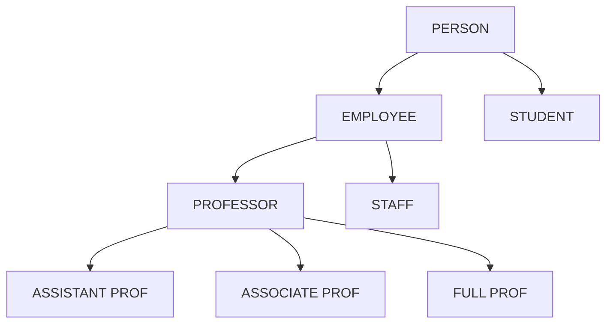

# SQL

|  | [](https://yourwebsite.com/) | [](https://github.com/DeviprasadShetty9833/My_Projects)  |                      
|---|---|---|

---

#### ER (Entity-Relationship) Model - The Foundation

-

*Core Components:*

```
Entity ------> Rectangle
Attribute ---> Oval
Relationship -> Diamond
```

*Example:*
```
STUDENT (Entity)
    ├── StudentID (Key Attribute)
    ├── Name
    ├── Age
    └── Rollno

COURSE (Entity)
    ├── CourseID (Key Attribute)
    ├── Title
    ├── Duration 
    └── Credits

STUDENT ENROLLS_IN (Relationship) COURSE
```

*Limitations of Basic ER:*

1. Cannot represent "specialization" (a Professor "is a" Employee)
2. Cannot show inheritance
3. Cannot represent union types
4. Limited constraints representation

---

#### EER (Enhanced Entity-Relationship) Model - The Extended Version

- 

Key Features ADDED in EER:

1) Specialization & Generalization

The "IS-A" Relationship



---

Full MySQL Command Arsenal ⚔️

✨ Each command includes general syntax, practical example, and clear explanation for easy understanding!

---

## 🏗️ 1. Database & Table Management

1. Creates a new database

```sql
CREATE DATABASE database_name;
```

*Example:*

```sql
CREATE DATABASE company;
```

*Explanation:*

- Creates a new database named 'company' where you can store tables and data.

2. Lists all databases

```sql
SHOW DATABASES;
```

*Example:*

```sql
SHOW DATABASES;
```

*Explanation:*

- Displays all databases available on the MySQL server including system and user databases.

3. Selects a database to work on

```sql
USE database_name;
```

*Example:*

```sql
USE company;
```

*Explanation:* 

- Switches to the specified database. All subsequent operations will be performed on this database.

4. Creates a new table

```sql
CREATE TABLE table_name (
    column1 data_type constraints,
    column2 data_type constraints
);
```

*Example:*

```sql
CREATE TABLE employees (
    id INT PRIMARY KEY AUTO_INCREMENT,
    name VARCHAR(50) NOT NULL,
    salary DECIMAL(10,2)
);
```

*Explanation:*

- Creates a table structure with defined columns, data types, and constraints. AUTO_INCREMENT automatically generates sequential numbers.

5. Shows table structure

```sql
DESC table_name;
```

*Example:*

```sql
DESC employees;
```

*Explanation:*

- Displays the complete structure of the table including column names, data types, and constraints.

6. Adds a new column

```sql
ALTER TABLE table_name ADD COLUMN column_name data_type;
```

*Example:*

```sql
ALTER TABLE employees ADD COLUMN email VARCHAR(100);
```

*Explanation:*

- Modifies an existing table by adding a new column to it.

---

## 🧱 2. Data Manipulation (DML)

Inserts a new record

```sql
INSERT INTO table_name VALUES (value1, value2, value3);
```

Example:

```sql
INSERT INTO employees VALUES (1, 'John Doe', 50000.00);
```

Explanation: Adds a complete new row to the table. Values must match the column order.

Inserts specific columns

```sql
INSERT INTO table_name (column1, column2) VALUES (value1, value2);
```

Example:

```sql
INSERT INTO employees (name, salary) VALUES ('Jane Smith', 60000.00);
```

Explanation: Adds a new row but only for specified columns. Auto-increment columns can be omitted.

Updates existing records

```sql
UPDATE table_name SET column = value WHERE condition;
```

Example:

```sql
UPDATE employees SET salary = 55000.00 WHERE id = 1;
```

Explanation: Modifies existing data in the table. WHERE clause is crucial to avoid updating all rows.

Deletes specific records

```sql
DELETE FROM table_name WHERE condition;
```

Example:

```sql
DELETE FROM employees WHERE id = 5;
```

Explanation: Removes specific rows from the table. Always use WHERE to avoid deleting all data.

Retrieves all records

```sql
SELECT * FROM table_name;
```

Example:

```sql
SELECT * FROM employees;
```

Explanation: Fetches all columns and all rows from the specified table.

Filters records with WHERE

```sql
SELECT columns FROM table_name WHERE condition;
```

Example:

```sql
SELECT name, salary FROM employees WHERE salary > 50000;
```

Explanation: Retrieves only rows that meet the specified condition.

Sorts results

```sql
SELECT columns FROM table_name ORDER BY column ASC|DESC;
```

Example:

```sql
SELECT name, salary FROM employees ORDER BY salary DESC;
```

Explanation: Sorts the result set in ascending (ASC) or descending (DESC) order.

Groups rows with aggregate

```sql
SELECT column, aggregate_function(column) 
FROM table_name 
GROUP BY column;
```

Example:

```sql
SELECT department, AVG(salary) 
FROM employees 
GROUP BY department;
```

Explanation: Groups rows that have the same values and applies aggregate functions to each group.

Joins tables

```sql
SELECT columns 
FROM table1 
JOIN table2 ON table1.column = table2.column;
```

Example:

```sql
SELECT e.name, d.department_name 
FROM employees e 
JOIN departments d ON e.dept_id = d.id;
```

Explanation: Combines rows from two or more tables based on a related column between them.

---

## 🔐 3. Data Definition (DDL)

Creates an index

```sql
CREATE INDEX index_name ON table_name(column_name);
```

Example:

```sql
CREATE INDEX idx_email ON users(email);
```

Explanation: Creates an index on a column to improve query performance for search operations.

Adds foreign key constraint

```sql
ALTER TABLE table_name 
ADD FOREIGN KEY (column) REFERENCES other_table(column);
```

Example:

```sql
ALTER TABLE orders 
ADD FOREIGN KEY (customer_id) REFERENCES customers(id);
```

Explanation: Ensures referential integrity by linking a column to a primary key in another table.

---

## 🧭 4. Transaction Control (TCL)

Begins a transaction

```sql
START TRANSACTION;
```

Example:

```sql
START TRANSACTION;
```

Explanation: Starts a transaction block. Subsequent statements become part of a single atomic operation.

Saves changes permanently

```sql
COMMIT;
```

Example:

```sql
COMMIT;
```

Explanation: Permanently saves all changes made during the current transaction.

Undoes changes

```sql
ROLLBACK;
```

Example:

```sql
ROLLBACK;
```

Explanation: Reverts all changes made during the current transaction.

---

## 👨‍💼 5. User & Privilege Management (DCL)

Creates a new user

```sql
CREATE USER 'username'@'host' IDENTIFIED BY 'password';
```

Example:

```sql
CREATE USER 'admin'@'localhost' IDENTIFIED BY 'securepass123';
```

Explanation: Creates a new database user with login credentials and host restriction.

Grants privileges

```sql
GRANT privilege ON database.table TO 'user'@'host';
```

Example:

```sql
GRANT SELECT, INSERT ON company.* TO 'manager'@'localhost';
```

Explanation: Gives specific permissions to a user for database objects.

---

## 🧮 6. Functions

Aggregate function - COUNT

```sql
SELECT COUNT(column) FROM table_name;
```

Example:

```sql
SELECT COUNT(*) FROM employees;
```

Explanation: Returns the number of rows that match the query criteria.

String function - CONCAT

```sql
SELECT CONCAT(string1, string2) FROM table_name;
```

Example:

```sql
SELECT CONCAT(first_name, ' ', last_name) AS full_name FROM employees;
```

Explanation: Combines two or more strings into a single string.

Date function - NOW

```sql
SELECT NOW();
```

Example:

```sql
SELECT NOW();
```

Explanation: Returns the current date and time.

Conditional function - CASE

```sql
SELECT CASE WHEN condition THEN result ELSE default END FROM table;
```

Example:

```sql
SELECT name,
    CASE 
        WHEN salary > 70000 THEN 'High'
        ELSE 'Standard'
    END as grade
FROM employees;
```

Explanation: Performs conditional logic within a SQL query.

---

## 🧠 7. Views & Procedures

Creates a view

```sql
CREATE VIEW view_name AS SELECT query;
```

Example:

```sql
CREATE VIEW high_paid_employees AS
SELECT name, salary FROM employees WHERE salary > 70000;
```

Explanation: Creates a virtual table based on a SQL query that can be queried like a regular table.

Creates a stored procedure

```sql
CREATE PROCEDURE procedure_name(parameters)
BEGIN
    SQL statements;
END;
```

Example:

```sql
DELIMITER //
CREATE PROCEDURE GetEmployeeCount()
BEGIN
    SELECT COUNT(*) FROM employees;
END //
DELIMITER ;
```

Explanation: Creates a reusable set of SQL statements that can be executed with a single call.

---

| [](#SQL) | [](https://yourwebsite.com/) |  |
|---|---|---|
